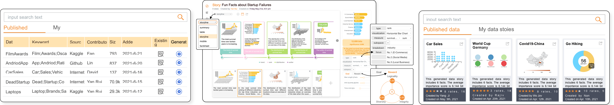

# Calliope

Calliope is a visual data story generation platform that employs advanced AI techniques to automatically analyze data and present data insights in the form of narrative visualization.




**Note!**: This is only a template project for deploying Calliope cloud service. The algorithms are not included. Please refer to our [website](https://datacalliope.com/) for usage or [project page](https://datacalliope.github.io) for more details.

## Deployment

Use [docker](https://hub.docker.com/editions/community/docker-ce-desktop-mac/) to run all services.

```
sudo docker-compose up -d --build
```

## Citation

```
@article{shi2020calliope,
      title={Calliope: Automatic Visual Data Story Generation from a Spreadsheet},
      author={Shi, Danqing and Xu, Xinyue and Sun, Fuling and Shi, Yang and Cao, Nan},
      journal = {IEEE Transactions on Visualization and Computer Graphics},
      year = {2020},
      publisher={IEEE}
    }
```